# CellProfiler基本使用
CellProfiler可以用于药物筛选，利用预先定义的手工特征进行特征提取，将特征利用基本的机器学习进行拟合，精准的判断属于哪种化合物影响的细胞反应。

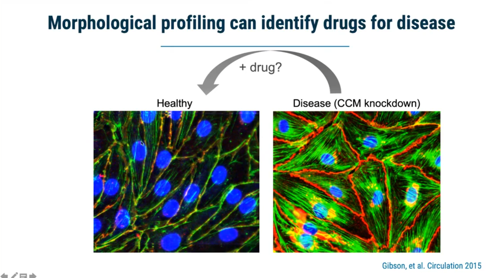

# 整体模型框架图
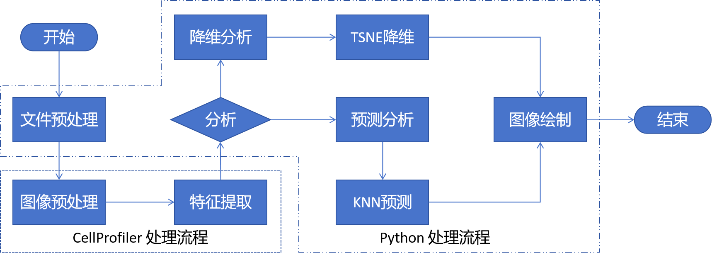

# 文件metadata的数据导出
为了方便文件的读取，尤其是CellProfiler以及后续的深度网络计算，这里采用了文件命名的方式存储图像中的细节信息。
如 **_clMcf7_exp20240515_h2_b2_ic1_cAA.tif _**，其对应含义如下：

- cl表示Cell Line细胞系类型，
- exp表示实验批次，利用时间进行表示，
- h表示时间点，
- b表示batch表示批次，相当于拍照的孔板批次，
- ic表示is control表示是否为控制组还是对照组，该参数类似于label标签定义，
- c表示channel通道定义，由于该模型具有FRET和MHCS所以 AA、DD、DA表示FRET通道定义，DNA，Nucleus等表示多亚细胞器的通道定义，
- .tiff 表示对应的图像信息

转换实验室图像存储名称格式的程序代码存放在在**_dataloader_**文件包内。
目前图像数据分为两类，一个是FRET图像以及明场BF图像
## FRET图像
目前具有6个通道数据，AA、DD、DA以及MB、ED、Rc

- MB 是AA、DD、DA三个通道图像交集得出的蒙版数据
- ED是计算FRET效率得出来的数据
- Rc是对应FRET蛋白的浓度比图像分布

## 明场图像
BF明场图像

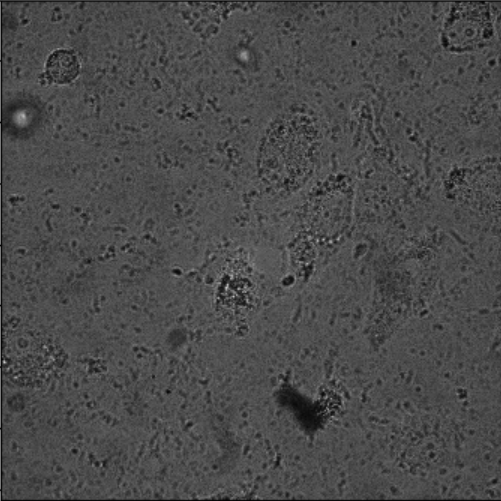
# 1. 预处理操作
## 1.1 高斯平滑
高斯滤波器，高斯滤波是一种线性平滑滤波，适用于消除高斯噪声，广泛应用于图像处理的减噪过程。将噪声减弱。
CellProfiler采用GaussianFilter模块进行处理。

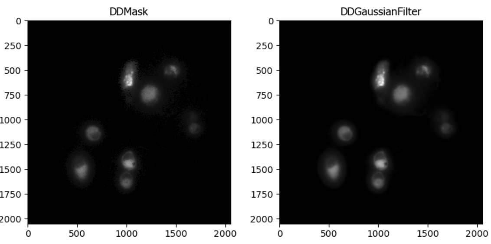
## 1.2 图像去噪
降低噪声。该模块执行非局部的降噪方法。这将运行一个5x5像素的补丁，最大距离为2像素，以搜索用于使用0.2的截止点去噪的补丁。ReduceNoise执行非局部均值降噪。不像在GaussianFilter中那样，只使用中心像素周围的像素邻域进行去噪，而是将多个邻域合并在一起。通过使用相关度量和截止值扫描图像以寻找与中心像素周围区域相似的区域来确定邻域池。
CellProfiler采用ReduceNoise模块。

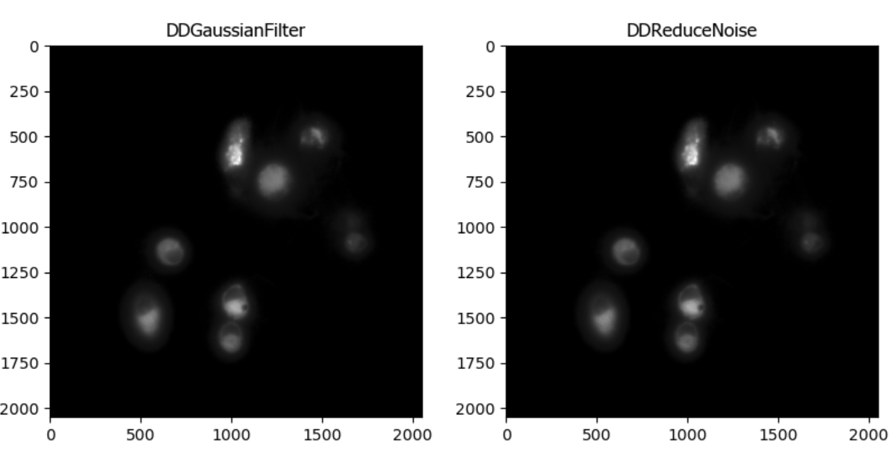

## 1.3 单细胞分割
利用DD图像进行细胞区域的获取，下图为2h的细胞图像
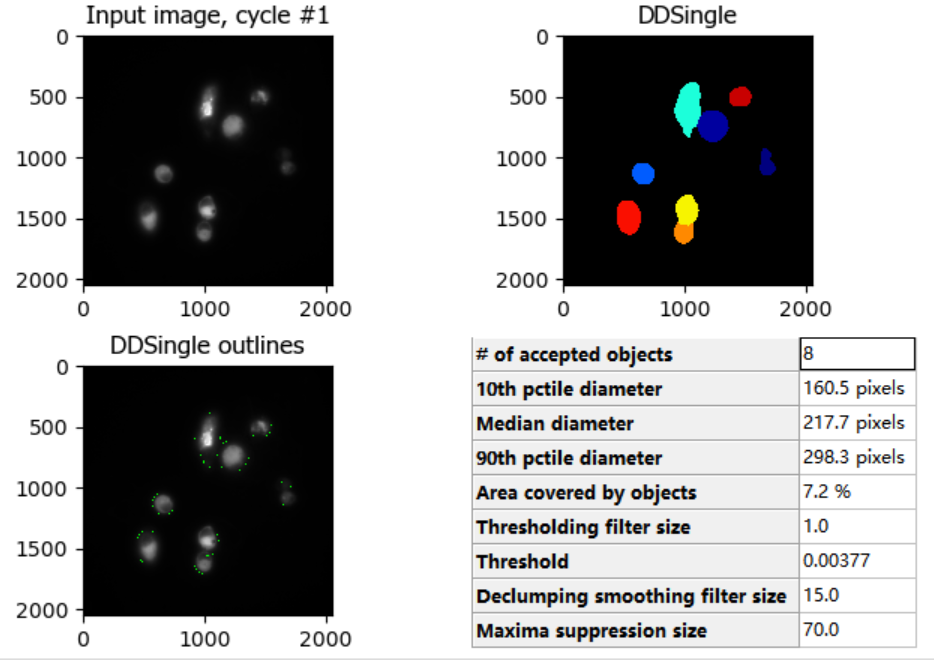

对于6h图像分割结果

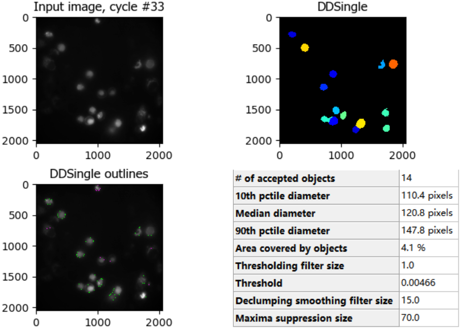

## 1.4 明场图像增强
将明场按照纹理进行提取，拿到纹理信息方便后面进行信息提取

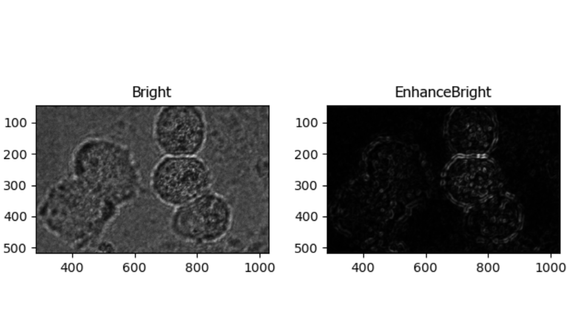

## 1.5 掩码无用信息
使用MB图像，屏蔽除了细胞以外无用的背景信息信息。
CellProfiler采用了MaskImage模块。利用Muban的0-1区域图像屏蔽掉不需要的明场图像。

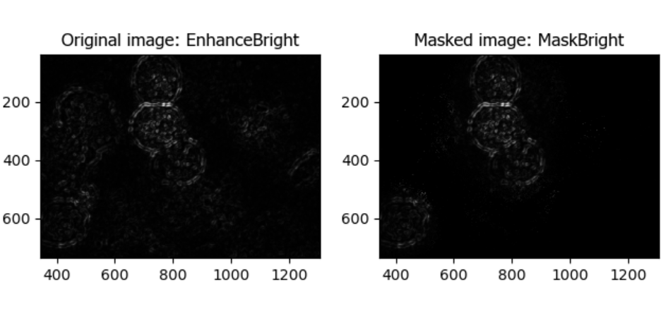

## 1.6 分割明场区域内的单细胞图像

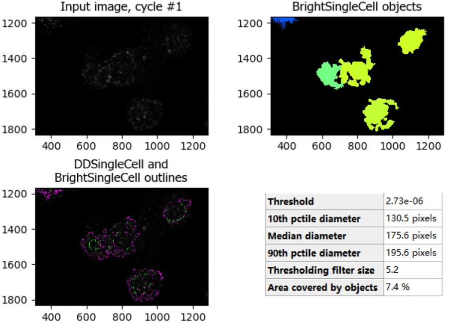

**这里的效果并不是很好，后期需要进行调整。尤其是细胞圆形过度。**

## 1.7 具体流程图详解
将上述步骤进行总结浓缩为如下的流程图示意图：

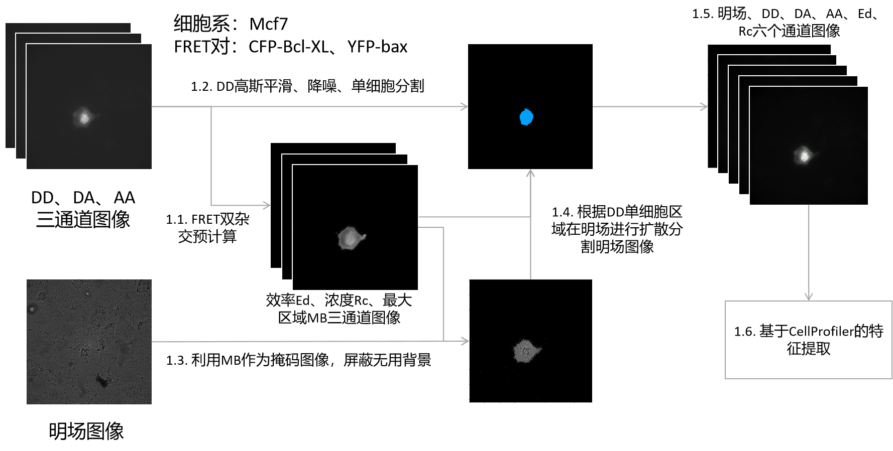

# 2. 特征提取

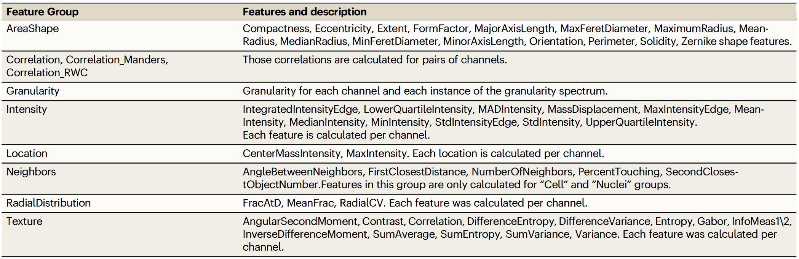

## 2.1 数据测量Measure
### 2.1.1 对于FRET荧光数据需要测量的部分

- 查看荧光图像的纹理光谱，MeasureGranularity输出图像中纹理的尺寸测量的光谱。
- 查看AA、DD、DA图像荧光强度。
- 查看ED的图像荧光强度，表示的是AA、DD、DA的荧光强度关系。
- 查看相邻单细胞之间的关系，MeasureObjectNeighbors计算每个对象有多少个邻居，并记录关于邻居关系的各种属性，包括接触邻居的对象边缘像素的百分比。
- 查看荧光强度的分布情况，MeasureObjectIntensityDistribution 查看单细胞内荧光分布情况，其中参数 bin设置为4标识利用4个区间段区分荧光强度分布情况
- 查看单细胞形态特征，MeasureObjectSizeShape测量细胞大小等形态信息。
- 查看单细胞纹理特征，MeasureTexture测量图像和对象中纹理的程度和性质，以量化其粗糙度和平滑度。

### 2.1.2 对于明场图像需要测量的部分

- 输出明场细胞的中细胞区域的大小以及形态学特征
- 查看纹理特征，利用明场图像的单细胞内的区域变化进行查看
- 查看强度纹理变化情况，也就是粒度梯度变化情况

## 2.2 数据输出
主要输出两类CVS文件，一个是文件存放路径的metadata文件，一个是但细胞特征输出的文件。
本实验过程输出了两个特征文件，分别是明场图像以及荧光图像
文件路径分别是 `data/2024515_BF_FRET_BFSingle.csv` 和 `data/2024515_BF_FRET_DDSingle.csv`

# 3. 分析模型
## 3.1 数据加载
### 3.1.1 数据清洗
删除无用的数据特征，如文件名称等，尤其是Metadata数据特征等

- **处理缺失值**：删除包含缺失值的行或列。
- **处理重复值**：删除完全重复的行或根据业务需求合并重复项。
- **处理异常值**：识别并处理异常值，如通过删除、替换、缩放到正常范围内或使用其他统计方法。

### 3.1.2 数据转换

- **标准化**：对于float64 以及 int64数据进行标准化操作。将数据按比例缩放，使其分布在均值为0、标准差为1的范围内。这通常用于数值型数据。
- **独热编码（One-Hot Encoding）**：将类别变量转换为机器学习算法可以理解的格式，通常用于处理分类数据。目前数据没有需要分类的特征。
- **标签编码（Label Encoding）**：将文本标签转换为整数。但这种方法可能导致模型误将标签视为有序数字，因此要小心使用。对于label需要进行标签编码操作。目前，处理的数据只有两个y值，一是加药实验组，二是对照组，分别采用了0，1进行标识。

### 3.1.3 特征选择

- 从原始数据集中选择最有用的特征子集。这可以通过统计测试（如卡方检验、互信息）、模型权重、特征重要性评分或其他方法来实现。
- 本实验采用了**互信息**的方式实现了特征筛选，将筛选得出的特征使用了pickle进行存储。

## 3.2 数据降维分析
数据降维分析操作，首先进行数据预处理，后进行降维分析，采用了TSNE算法和UMAP算法共同分析处理

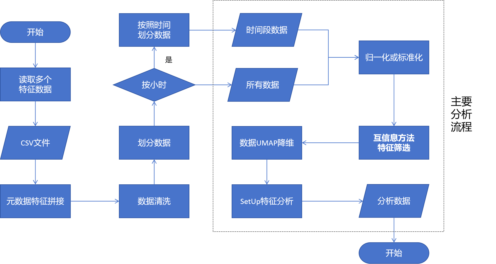

## 3.3 数据分类分析
使用KNN算法进行分析处理

# 4. 实验结果
目前数据集具有2h、4h、5h和6h，从6h开始实现简单的数据特征提取，以及降维分析操作。
## 4.1 数据降维结果
采用TSNE和UMAP算法进行操作进行分析分类
### 4.1.1 仅通过明场 BF 图像分析能够进行分类
- 我们分析了2-6小时对照组的明场图像降维分析结果

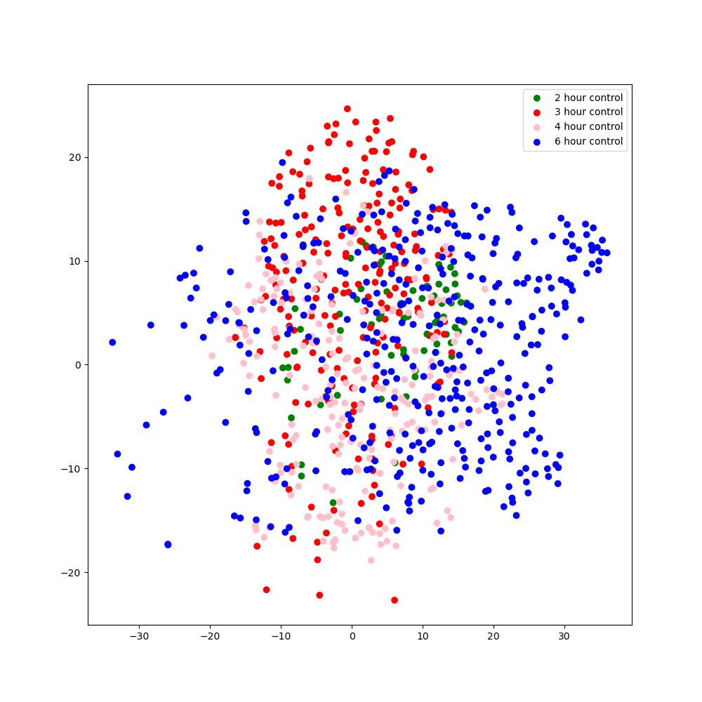

- 我们分析了2-6小时对照组和加药实验组的降维分析结果

### 4.1.2 仅通过FRET图像分析能否进行分类
- FRET 图像在不同小时的分类划分情况，这里使用了每个小时的有效特征进行提取分析

- 我们将每个小时的有效特征进行提取获取有效特征的并集进行降维分类操作

## 4.2 数据分类结果
采用KNN算法进行分析，首先是利用单独明场的特征查看数据能否较好的预测细胞状态，判断是不是加药的细胞

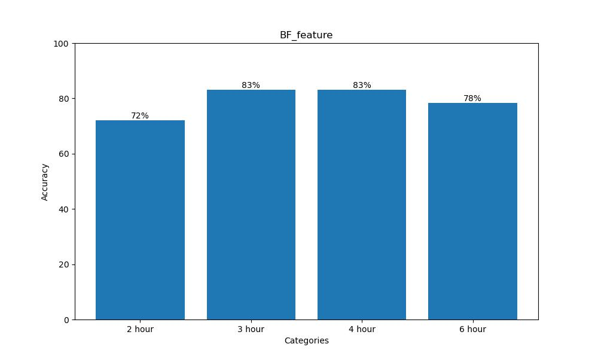

其次，采用了明场加FRET图像的细胞特征进行预测细胞状态

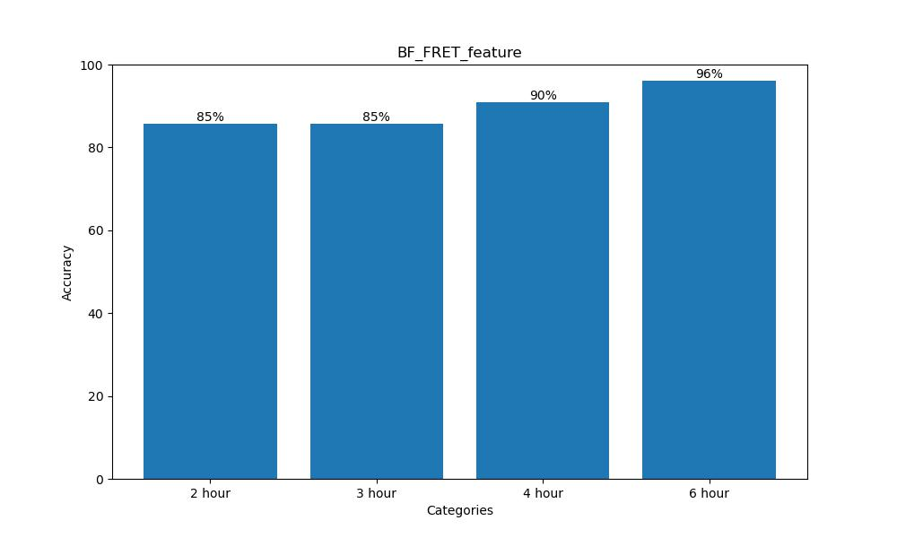

# 5. 算法讲解
## 5.1 UMAP 降维算法
## 5.2 TSNE 降维算法
## 5.3 互信息算法
## 5.4 KNN 算法
