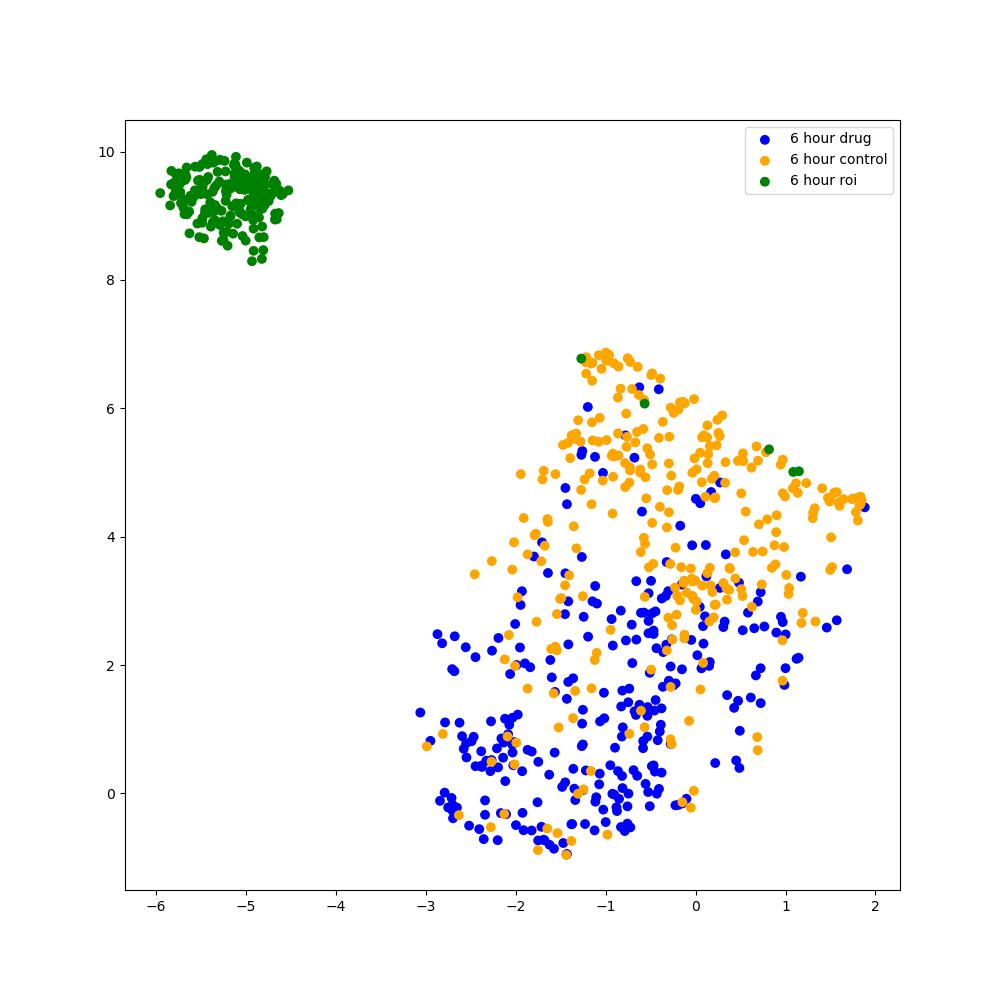
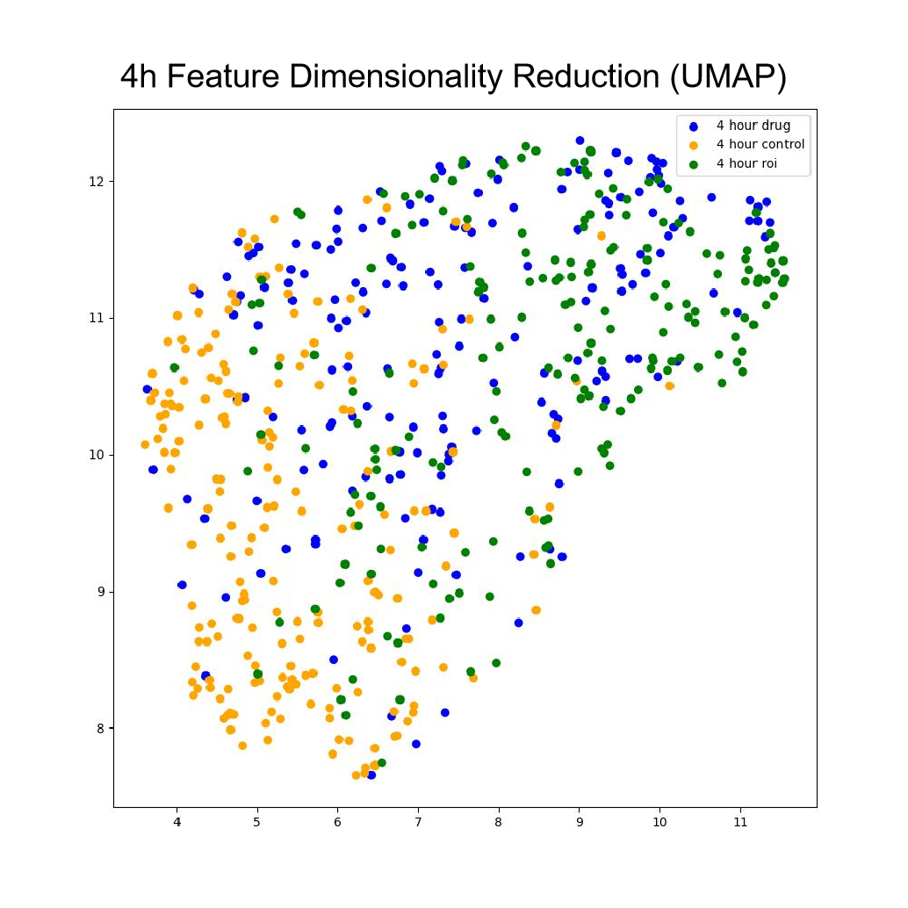

# 20240629实验记录
我们添加了新的一组数据roi，表示表型改变而FRET没有发生变化，作为对照组之一。

# 上周试验记录问题思考

- 阈值分割有问题，强化阈值分割粒度，不要尝试把所有情况囊括，应该适当抛弃一些人眼都不明显的单细胞数据
- 图像数据集存在一定的问题，6h小时图像太过于模糊，尤其是荧光图像噪声太大，所以应该尝试切换到4小时数据上

# 1. 分割流程改进

- 原有流程中，添加 rescale 函数调整荧光强度范围归一化为0-255之间，计算DD、DA、AA通道
- 利用 max(DD, DA, AA) 计算每个图像像素最大值，组成三通道最大强度图像，便于综合三者进行阈值分割

# 2. 分析结果

符合生物可解释性，drug组和roi混合在一起，而control和drug有部分区分。

